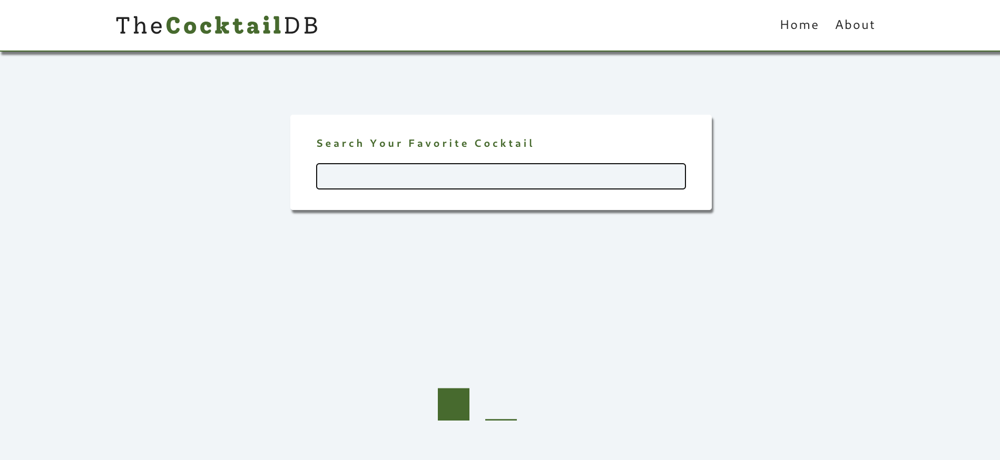
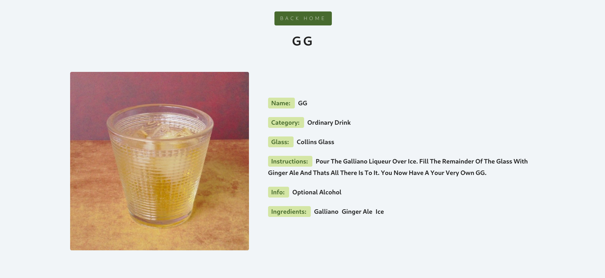
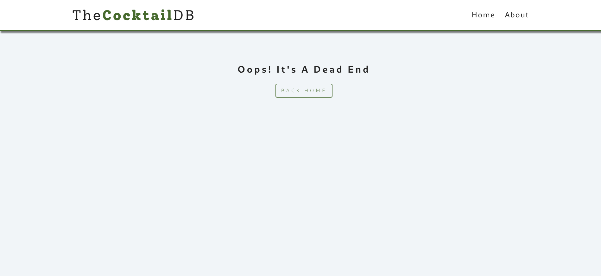
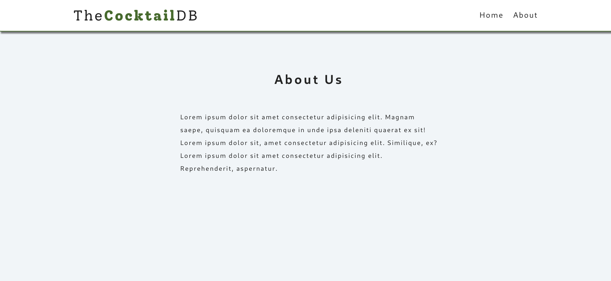

## Cocktails Project

Live: [React Cocktails Project](https://my-react-project-cocktail.netlify.app/)

#### React Router Fix

(Fix)[https://dev.to/dance2die/page-not-found-on-netlify-with-react-router-58mc]

#### CRA Fix

```

"build": "CI= react-scripts build",

```

```sh
npm install react-router-dom@6
```

### Languages and Tools 🗣️🔧

1. **Languages** 🗣️

   - [HTML](https://github.com/topics/html)
   - [HTML5](https://github.com/topics/html5)
   - [CSS](https://github.com/topics/css)
   - [CSS3](https://github.com/topics/css3)
   - [React](https://github.com/topics/react)

2. **Tools** 🔧
   - [Chrome](https://github.com/topics/chrome)
   - [Figma](https://github.com/topics/figma)
   - [VSCode](https://github.com/topics/vscode)
   - [Netlify](https://github.com/topics/netlify)

### Screenshots of the Project

#### Home page


#### When Loading



#### Cocktails types


#### Single Cocktail



#### Error



#### About page


